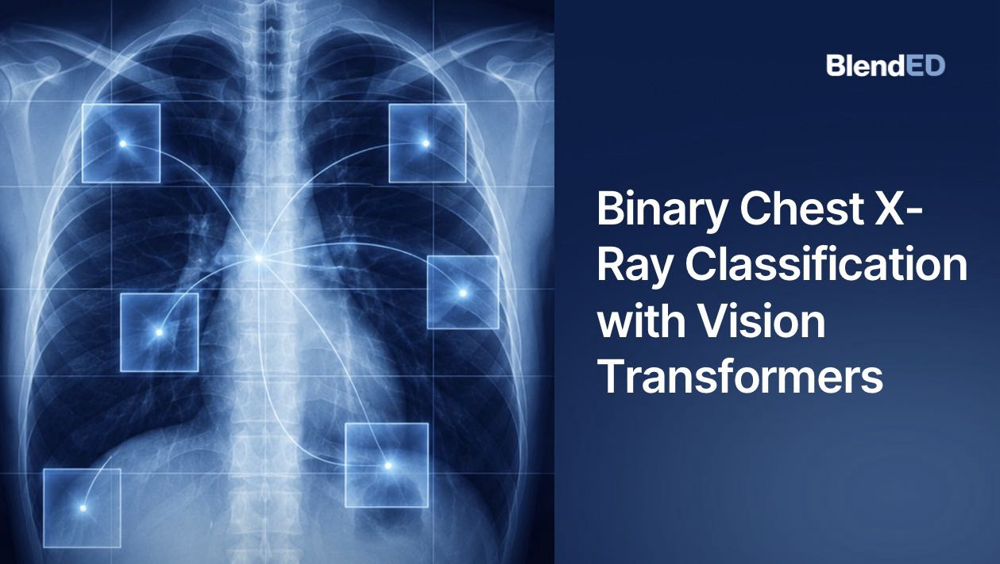
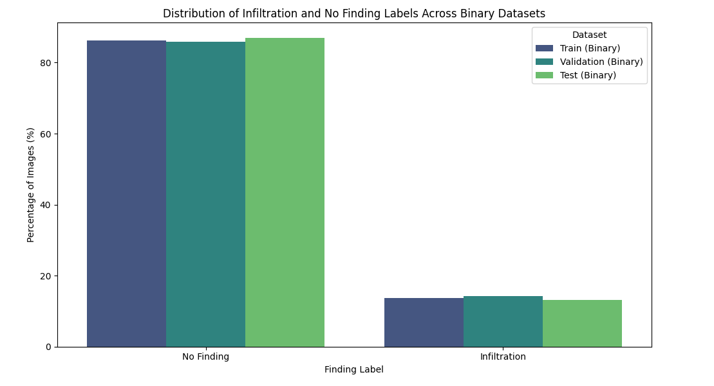
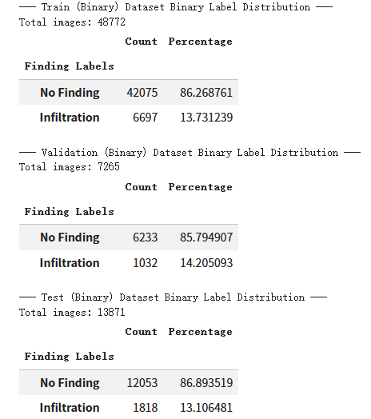
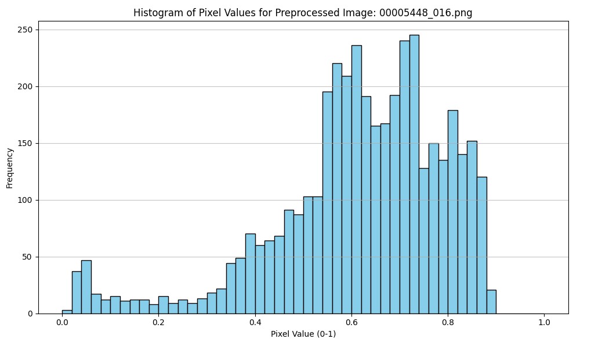
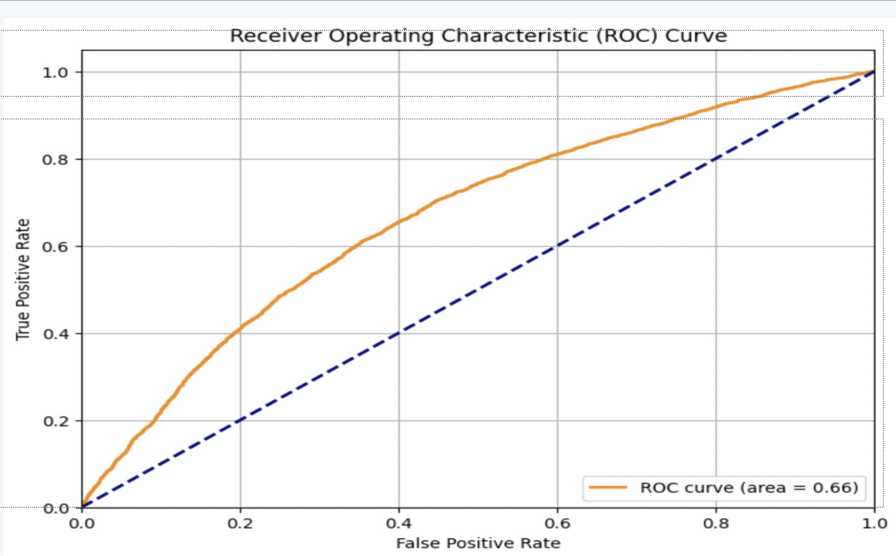

# ViT Chest X-ray Classification

A research-oriented medical imaging project exploring the application of Vision Transformers (ViTs) for automated chest X-ray classification using the NIH ChestX-ray8 dataset. 

This project is part of the Novo Nordisk Project for AI and Computer Vision in Biotech by BlendED from March 9th to May 14th, 2026.

<p align="center">
  
</p>

<h1 align="center">Vision Transformer for Chest X-ray Classification</h1>

<p align="center">
A PyTorch-based Vision Transformer (ViT) project for binary chest X-ray classification using the NIH ChestX-ray8 dataset.
</p>

<p align="center">
  
  
  
  
  
</p>

---

# Project Overview

This project explores the application of Vision Transformers (ViTs) for automated chest X-ray classification using the NIH ChestXray8 dataset. The project focuses on understanding how transformer-based deep learning can be adapted for medical imaging tasks, particularly binary classification of normal versus abnormal chest X-rays.

The NIH ChestXray8 dataset contains over 112,000 chest X-ray images collected from more than 30,000 patients and includes labels for 14 thoracic diseases alongside a "No Finding" category. Due to the large volume of medical imaging data and the complexity of radiological interpretation, there is increasing interest in AI-assisted diagnostic systems that can support clinicians by improving speed, consistency, and scalability in medical image analysis.

Our project investigates:

* Patient-level dataset splitting to avoid data leakage
* Image preprocessing for medical imaging workflows
* Vision Transformer implementation from scratch in PyTorch
* Binary classification experiments on chest X-ray images
* Training behavior under limited computational resources
* Overfitting and class imbalance challenges in medical AI
* Evaluation using Accuracy, Recall, F1-score, and Confusion Matrix

This repository is designed as a reproducible educational research project for understanding Vision Transformers in healthcare imaging.

---

# Key Features

* Vision Transformer implementation from scratch
* Chest X-ray classification using NIH ChestXray8
* Patient-level stratified train/validation split
* Configurable binary classification pipeline
* PyTorch-based training workflow
* Google Colab compatible implementation
* Evaluation with Recall and F1-score
* Checkpoint saving and recovery system
* Visualization of training curves and metrics
* Experimental analysis of overfitting and class imbalance

---

# Quick Start

## 1. Clone Repository

```bash
git clone https://github.com/TLOMMY/ViT-ChestXray8-Classification.git
cd ViT-ChestXray8-Classification
```

---

## 2. Install Requirements

```bash
pip install -r requirements.txt
```

---

## 3. Download NIH ChestXray8 Dataset

This project uses the NIH ChestXray8 dataset from Kaggle.

```python
import kagglehub

path = kagglehub.dataset_download("nih-chest-xrays/data")
print(path)
```

Dataset Link:

[https://www.kaggle.com/datasets/nih-chest-xrays/data](https://www.kaggle.com/datasets/nih-chest-xrays/data)

---

## 4. Run Training

```bash
python scripts/train.py
```

---

## 5. Run Evaluation

```bash
python scripts/evaluate.py
```

---

# Project Structure

```text
ViT-ChestXray8-Classification/
# Project Structure
├── configs/             
│   └── config.py        # Main configuration file (paths, hyperparameters, training settings)
│
├── docs/                
│   ├── ViT Overview.pdf # ViT theoretical framework overview
│   └── setup.md         # Environment setup and running instructions
│
├── figures/             # Visualizations and experiment result plots
│   ├── Loss and Accuracy Curves on the Subdataset.png
│   ├── Metadata Example of Training and Validation Subsets.png
│   ├── Preprocessed Training Data Samples.png
│   ├── Training Loss and Metrics on the Full Dataset.png
│   ├── detailed engineering pipeline.png
│   ├── label_distribution.png
│   ├── label_distribution_data.png
│   ├── overall pipeline.png
│   ├── pixel_histogram.png
│   └── vit architecture.png
│
├── outputs/             
│   ├── confusion_matrix(Samp).png  
│   └── training_history(Samp).png          
│
├── scripts/             # Executable scripts
│   ├── train.py         # Training script
│   └── evaluate.py      # Evaluation script
│
├── src/                 # Core source code
│   ├── __init__.py      # Package initialization
│   ├── dataset.py       # Dataset loading and preprocessing
│   ├── evaluate.py      # Evaluation logic
│   ├── model.py         # ViT model definition
│   ├── train.py         # Training loop implementation
│   └── utils.py         # Utility functions (plotting, config parsing, etc.)
│
├── LICENSE              
├── README.md            
├── ViT_binary.ipynb     # Main Jupyter notebook
└── requirements.txt     # Python dependencies
```

---

# Pipeline Overview

## Overall Workflow

<p align="center">
  
</p>

The project pipeline consists of:

1. Dataset Download and Loading
2. Patient-level Stratified Splitting
3. Image Preprocessing
4. Label Encoding
5. Vision Transformer Training
6. Validation and Evaluation
7. Metric Analysis and Visualization

---

## Detailed Engineering Pipeline

<p align="center">
  
</p>

### Data Processing Steps

* Download NIH ChestXray8 dataset
* Group images by Patient ID
* Perform patient-level stratified splitting
* Prevent train/validation data leakage
* Filter target disease labels
* Convert labels into numerical format

### Preprocessing Operations

* Convert images to grayscale
* Resize images from 1024×1024 to 64×64
* Normalize pixel values to [0,1]
* Convert images to PyTorch tensors
* Load images using DataLoader

### ViT Components

* Patch Embedding
* CLS Token
* Positional Encoding
* Multi-Head Self Attention
* Transformer Encoder Blocks
* MLP Classification Head

### Training Features

* Adam Optimizer
* CrossEntropyLoss
* Validation Monitoring
* Checkpoint Saving
* Accuracy / Recall / F1-score Tracking
* Confusion Matrix Evaluation

---

## Vision Transformer Pipeline

<p align="center">
  
</p>

---

## Final Experimental Configuration

| Parameter           | Value            |
| ------------------- | ---------------- |
| Image Size          | 64 × 64          |
| Patch Size          | 16 × 16          |
| Batch Size          | 64               |
| Num Heads           | 4                |
| Embedding Dimension | 32               |
| MLP Dimension       | 64               |
| Transformer Layers  | 1                |
| Optimizer           | Adam             |
| Learning Rate       | 0.01             |
| Loss Function       | CrossEntropyLoss |
| Epochs              | 150              |
| Framework           | PyTorch          |
| Platform            | Google Colab     |

---

# Dataset

## NIH ChestXray8 Dataset

This project uses the NIH ChestXray8 dataset, a large-scale chest X-ray dataset released by the National Institutes of Health (NIH).

Dataset Statistics:

| Item           | Value                |
| -------------- | -------------------- |
| Total Images   | 112,120              |
| Patients       | 30,000+              |
| Disease Labels | 14                   |
| Imaging Type   | Frontal Chest X-rays |
| Dataset Source | NIH Clinical Center  |

The dataset includes thoracic disease labels such as:

* Atelectasis
* Cardiomegaly
* Effusion
* Infiltration
* Mass
* Nodule
* Pneumonia
* Pneumothorax
* No Finding

---

## Dataset Reference

Wang, X. et al.

"ChestX-ray8: Hospital-scale Chest X-ray Database and Benchmarks on Weakly-Supervised Classification and Localization of Common Thorax Diseases"

[https://arxiv.org/abs/1705.02315](https://arxiv.org/abs/1705.02315)

Kaggle Dataset:

[https://www.kaggle.com/datasets/nih-chest-xrays/data](https://www.kaggle.com/datasets/nih-chest-xrays/data)

---

# Data Preprocessing

## Patient-Level Stratified Split

To avoid data leakage, images were split at the patient level instead of image level.

This ensures:

* The same patient does not appear in both training and validation sets
* Better generalization evaluation
* More realistic medical AI experiments

---

## Label Encoding

Binary classification experiments were conducted using:

* No Finding
* Infiltration

Labels were converted into numerical format:

```python
{"No Finding": 0, "Infiltration": 1}
```

---

## Multi-hot Encoding

The repository also supports multi-label encoding for future multi-disease classification experiments.

---

## Preprocessing Visualization

### Sample Preprocessed Images

<p align="center">
  
</p>

---

### Label Distribution

<p align="center">
  
</p>

<p align="center">
  
</p>

---

### Pixel Histogram Analysis

<p align="center">
  
</p>

---

### Stratified Validation Sampling

<p align="center">
  
</p>

---

# Experimental Setup

## Small Dataset Experiment

Initial experiments were conducted using:

| Dataset Split  | Images |
| -------------- | ------ |
| Training Set   | 1,000  |
| Validation Set | 200    |

The purpose of this stage was:

* Faster iteration cycles
* Architecture debugging
* Hyperparameter testing
* Training behavior analysis

---

## Full Dataset Experiment

Larger experiments were later conducted using:

| Dataset Split  | Images |
| -------------- | ------ |
| Training Set   | 10,000 |
| Validation Set | 2,000  |

The full dataset experiments focused on:

* Reducing overfitting
* Improving generalization
* Evaluating Recall and F1-score
* Measuring scalability limitations in Google Colab

---

## Hyperparameter Experiments

Several configurations were tested:

| Num Heads | Embed Dim | MLP Dim | Result              |
| --------- | --------- | ------- | ------------------- |
| 1         | 16        | 16      | Poor convergence    |
| 4         | 32        | 64      | Best performance    |
| 8         | 32        | 64      | Slower and unstable |

Observations:

* 4 attention heads performed better than 8 heads
* Smaller images improved training speed
* High learning rate caused instability
* Validation accuracy plateaued due to overfitting and imbalance

---

# Results

## Training Curves

<p align="center">
  
</p>

### Observations

| Metric              | Observation                               |
|---------------------|-------------------------------------------|
| Training Loss       | Gradually decreased throughout training   |
| Training Accuracy   | Increased steadily during training        |
| Validation Accuracy | Plateaued around 64%                      |
| Validation F1-score | Peaked near epoch 30 then slowly declined |
| Validation Recall   | Fluctuated across epochs                  |

### Interpretation

The training curves indicate clear signs of overfitting after approximately epoch 30.  
While training accuracy continued to improve, validation performance stopped improving and began fluctuating.

This suggests that the model gradually memorized training samples instead of learning generalized radiological features.

---

## Validation Metrics

| Metric | Best Value |
|---|---|
| Training Accuracy | ~67% |
| Validation Accuracy | ~64% |
| Validation F1-score | ~64% |
| Validation Recall | ~59% |
| ROC-AUC | ~0.66 |

### Notes

Validation accuracy alone was not sufficient for evaluating the model because the dataset was imbalanced between “No Finding” and “Infiltration” labels.

For this reason, F1-score, Recall, ROC-AUC, and Confusion Matrix analysis were included to better evaluate model behavior.

---

## Confusion Matrix

<p align="center">
  
</p>

### Validation Set Results

| True Label | Predicted No Finding | Predicted Infiltration |
|---|---|---|
| No Finding | 4453 | 1780 |
| Infiltration | 2734 | 3040 |

### Key Findings

The model performed better on the majority class (“No Finding”) than on the minority abnormal class (“Infiltration”).

A large number of false negatives were observed, meaning many abnormal chest X-rays were incorrectly classified as normal.

This is particularly problematic in medical AI systems because missed abnormal cases may delay diagnosis and treatment.

---

## ROC Curve

<p align="center">
  
</p>

| Metric | Value |
|---|---|
| AUC | 0.66 |

### Interpretation

The ROC curve demonstrates that the model performs better than random guessing, but its discriminative ability remains limited.

The relatively low AUC indicates that the lightweight Vision Transformer struggled to reliably separate normal and abnormal chest X-rays under the current training configuration.

---

## Small Dataset Experiment

A smaller binary classification experiment was also conducted using:

- 1,000 training images
- 200 validation images
- Labels:
  - No Finding
  - Infiltration

### Small Subset Results

<p align="center">
  
</p>

| Metric | Value |
|---|---|
| Training Accuracy | ~96% |
| Validation Accuracy | ~80% |

Although these results initially appeared promising, further analysis suggested that class imbalance heavily influenced the accuracy score.

Because “No Finding” samples significantly outnumbered “Infiltration” samples, the model could achieve high accuracy by favoring majority-class predictions.

This experiment highlighted the importance of using Recall and F1-score instead of relying only on accuracy in medical classification tasks.

---

# Discussion & Limitations

## Key Findings

This project demonstrated that Vision Transformers can be applied to chest X-ray classification, but several important limitations emerged during experimentation.

The model successfully learned basic image patterns and achieved moderate validation performance; however, generalization remained limited due to multiple constraints related to data imbalance, model capacity, and computational resources.

---

## Main Challenges

| Challenge | Impact |
|---|---|
| Class imbalance | Model biased toward predicting “No Finding” |
| Low image resolution (64×64) | Fine pathological details were lost |
| Lightweight ViT architecture | Limited feature extraction capability |
| Hardware limitations | Restricted larger experiments and higher-resolution training |
| Limited training resources | Prevented extensive hyperparameter tuning |

---

## Why Accuracy Alone Was Misleading

One important finding was that validation accuracy alone did not accurately reflect clinical usefulness.

Because the dataset contained significantly more “No Finding” samples than “Infiltration” samples, the model could obtain relatively high accuracy while still failing to correctly detect many abnormal cases.

For this reason, additional evaluation metrics such as:

- Recall
- F1-score
- ROC-AUC
- Confusion Matrix

were necessary to better understand the model’s behavior.

This revealed that the model struggled particularly with sensitivity toward abnormal findings.

---

## Overfitting Behavior

The training curves showed a growing gap between training and validation performance during later epochs.

This indicates that the model gradually memorized training samples instead of learning generalized radiological representations.

The overfitting issue became especially visible after approximately epoch 30, where validation F1-score and Recall stopped improving despite continued decreases in training loss.

---

## Resolution Trade-off

Due to Google Colab GPU limitations, chest X-ray images were resized from:

- Original resolution: 1024×1024
- Training resolution: 64×64

Although this significantly reduced training time and memory usage, it also removed important medical details such as:

- subtle infiltrates
- texture patterns
- fine opacity regions

This likely reduced the model’s ability to distinguish pathological findings.

---

## Architectural Limitations

Compared to standard Vision Transformer architectures, the implemented model used:

| Standard ViT | Our Configuration |
|---|---|
| 12 Transformer layers | 1 layer |
| 768 embedding dimension | 32 |
| 224×224 input | 64×64 input |
| Large-scale pretraining | No pretraining |

The simplified architecture was necessary for resource constraints, but it also limited representation learning capacity.

---

# Future Work

##Data

*  Class balancing with weighted sampling
*  Stronger data augmentation
  (Rotation, Flipping, MixUp, CutMix)
* Higher-resolution chest X-ray inputs

##Training

* Early stopping to reduce overfitting
* Learning rate and batch size tuning
* Transfer learning with pretrained ViT
* Mixed precision training for faster experiments

##Evaluation

* Threshold tuning for classification
* K-fold cross-validation
*  Grad-CAM explainability visualization

Future research direction ：
* Multi - Class Classification
* Advanced Vision Transformer Architectures
* Multi - Label Classification

```

---

References

Vision Transformer

Dosovitskiy, A. et al.

"An Image is Worth 16x16 Words: Transformers for Image Recognition at Scale"

[https://arxiv.org/abs/2010.11929](https://arxiv.org/abs/2010.11929)

---

NIH ChestXray8

Wang, X. et al.

"ChestX-ray8: Hospital-scale Chest X-ray Database and Benchmarks on Weakly-Supervised Classification and Localization of Common Thorax Diseases"

[https://arxiv.org/abs/1705.02315](https://arxiv.org/abs/1705.02315)

---

Team Contributions

| Team Member   | Contribution                                                                                                                 |
| ------------- | -----------------------------------------------------------------------------------------------------------------------------|
| Jessie B      | Background and motivation                                                                                                    |
| Beatriz Graça | Methodology                                                                                                                  |
| Mashiro Yasuda| Construction of the ViT code, Data collection                                                                                |
| Advik Iyer    | Experiment analysis                                                                                                          |
| Zhuoming Liang| Future Work                                                                                                                  |
| Bowen Liu     | The full Setup of the GitHub repository, Pipeline refactoring                                                                |

---

Acknowledgements

We thank:

* Alex for his full - process guidance and help.
* NIH Clinical Center for releasing the ChestXray8 dataset
* PyTorch developers
* Google Colab for providing accessible GPU resources
* Open-source medical AI research communities

---

License
MIT License
